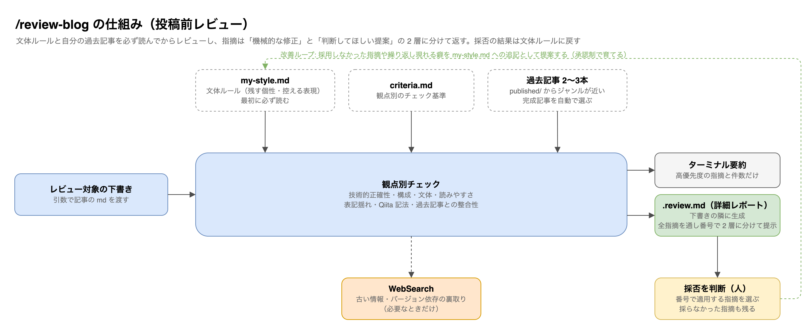
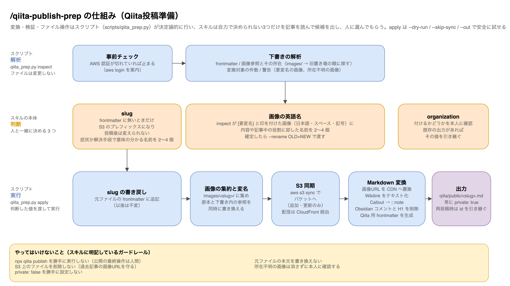
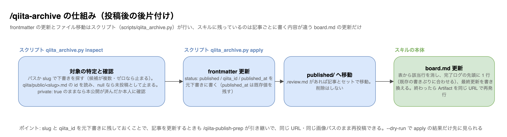

# ブログ執筆スキル一式

私が普段のブログ執筆で使っているClaude Codeのスキル4本です。記事執筆方法の共有会で配布したものを、公開用に一部プレースホルダーへ置き換えて公開しています。

| スキル | 役割 |
|---|---|
| review-blog | 投稿前レビュー。自分の過去記事を基準に、文体・構成・技術的正確性をチェック |
| qiita-publish-prep | Qiita投稿準備。下書きをQiita CLI用に変換し、画像をS3+CloudFrontへ同期 |
| qiita-archive | 投稿後の後片付け。Pythonスクリプトがfrontmatter更新とアーカイブ移動を行い、スキル側はステータスボードの更新だけ |
| export-drawio | drawioの図を高解像度PNG（3倍・透過）に書き出し |

## 全体のワークフロー

前提として、記事は articles リポジトリ（プライベート）の `drafts/` で書き始めます。`drafts/` 配下のステータスフォルダ（10_アイデア / 20_執筆中 / 30_レビュー待ち / 40_限定公開）が記事の状態の正で、書き上がったらレビュー → 限定共有で投稿 → 本公開 → アーカイブと進みます。スキル3本はこの流れの決まった位置で呼ばれる、という分担です。


公開の最終操作（`npx qiita publish`）だけはスキルにやらせず、必ず人間が実行する線引きにしています。export-drawio はこの流れとは独立した小物で、記事に貼る図を書き出すときに単発で呼びます。

## 各スキルの仕組み

### review-blog（投稿前レビュー）

文体ルール（`references/my-style.md`）と自分の過去記事2〜3本を必ず読んでからレビューする作りです。指摘は「機械的な修正（考えなくていい）」と「判断してほしい提案（考えるところ）」の2層に分けて出てきます。



### qiita-publish-prep（Qiita投稿準備）

Obsidianで書いた下書きをQiita CLIが読める形に変換しつつ、画像をS3へ同期してMarkdown内の参照をCDNのURLに置き換えます。



### qiita-archive（投稿後の後片付け）

slug と qiita_id を元下書きに残しておくことで、記事を更新するときも同じURL・同じ画像パスのまま再投稿できるようにしています。

frontmatter の更新とファイル移動は `scripts/qiita_archive.py` に切り出しました（2026-09-04）。`inspect` で対象と公開状態を確かめ（未公開なら止まる）、`apply` で `status` / `qiita_id` / `published_at` を書き込んでレビューレポートごと `published/` へ移します。スキルに残したのはステータスボード（board.md）の更新だけで、ここは記事ごとに書く内容が違うので自動化していません。



## 導入方法

フォルダごと `~/.claude/skills/` にコピーすると、Claude Codeで `/review-blog` のようにスラッシュコマンドとして呼べるようになります。

```
cp -R review-blog qiita-publish-prep qiita-archive export-drawio ~/.claude/skills/
```

## そのまま使えるか

私の環境（ファイルパス・過去記事の置き場・運用ルール）が手順書にそのまま書いてあるので、動かすには自分の環境向けの書き換えが必要です。

- review-blog … 過去記事のパスと `references/my-style.md`（文体ルール）を自分のものに差し替えれば使えます。まず自分の文体ルールを言語化するところから始めるのがおすすめです
- qiita-publish-prep … S3+CloudFrontの画像配信基盤が前提なので、そのままでは動きません。変換ルールや「どこで人間に確認を取るか」の設計の参考にしてください
- qiita-archive … `scripts/qiita_archive.py` 先頭の定数（記事リポジトリと Qiita CLI ワークスペースのパス）を自分の構成に合わせれば使えます
- export-drawio … draw.ioデスクトップアプリ（`brew install --cask drawio`）があればそのまま動きます

## 取り扱いについて

個人環境のフォルダ構成や運用ルールは、実物の雰囲気が伝わるようあえてそのまま残しています。S3バケット名など環境固有の識別子だけ `<your-bucket>` のようなプレースホルダーに置き換えてあります。ライセンスはMITです。自由にコピーして、自分の環境に合わせて書き換えて使ってください。
