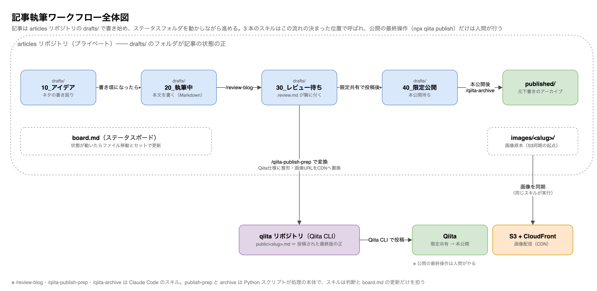

# 記事執筆の全体の流れ

前提として、記事は記事リポジトリ（プライベート）の `drafts/` で書き始めます。`drafts/` 配下のステータスフォルダ（10_アイデア / 20_執筆中 / 30_レビュー待ち / 40_限定公開）が記事の状態の正で、書き上がったらレビュー → 限定共有で投稿 → 本公開 → アーカイブと進みます。スキル3本はこの流れの決まった位置で呼ばれる、という分担です。



公開の最終操作（`npx qiita publish`）だけはスキルにやらせず、必ず人間が実行する線引きにしています。export-drawio はこの流れとは独立した小物で、記事に貼る図を書き出すときに単発で呼びます。

## 前提にしている記事リポジトリの構成

スキルは、設定値「記事リポジトリ」で指定したディレクトリに次の構成があることを前提にしています。

```
<記事リポジトリ>/
  drafts/          下書き。ステータスごとのサブフォルダに置く
  images/<slug>/   記事ごとの画像原本。qiita-publish-prep がここへ集約して S3 に同期する
  published/       本公開してアーカイブした記事とレビューレポート
  board.md         ステータスボード。qiita-archive が更新する
```

下書きの frontmatter には `title` / `tags` に加えて、qiita-publish-prep が付ける `slug` と、qiita-archive が付ける `qiita_id` / `published_at` / `status` が入ります。slug は S3 のプレフィックスと画像 URL に使われるので、一度決めたら変えません。

## Qiita CLI ワークスペース

設定値「Qiita CLI ワークスペース」は `npx qiita init` したディレクトリです。qiita-publish-prep が `public/<slug>.md` を出力し、人間が `npx qiita preview` で確認して `npx qiita publish <slug>` で投稿します。qiita-archive は同じファイルから投稿後の `id` を読み取ります。
